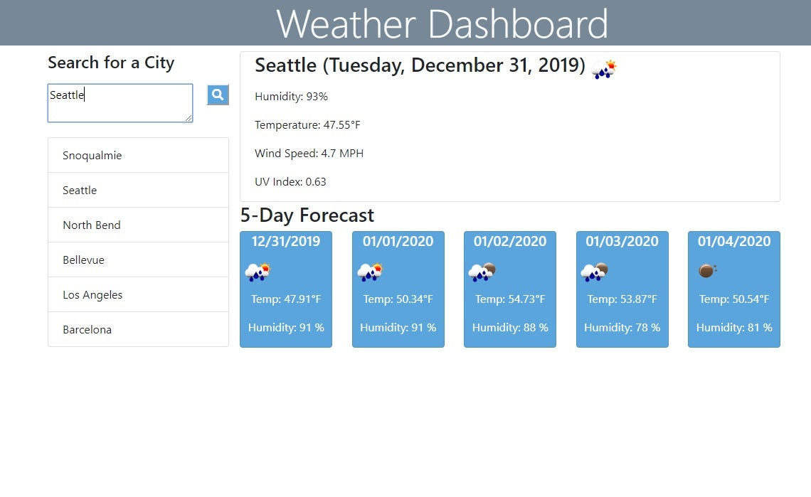

# WeatherDashboard       https://julie-git.github.io/weatherdashboard/

The weather dashboard uses the OpenWeather API to find weather conditions on cities.  The user will be able to search on any city in the world and obtain weather information.

 Display the following under current weather conditions:

  * City

  * Date

  * Icon image (visual representation of weather conditions)

  * Temperature

  * Humidity

  * Wind speed

  * UV index

* Include a search history so that users can access their past search terms. Clicking on the city name should perform a new search that returns current and future conditions for that city. 

* Include a 5-Day Forecast below the current weather conditions. Each day for the 5-Day Forecast should display the following:

  * Date

  * Icon image (visual representation of weather conditions)

  * Temperature

  * Humidity

   